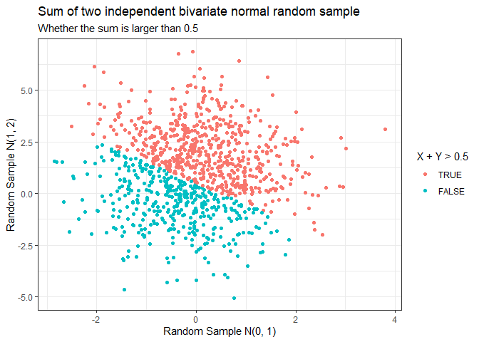
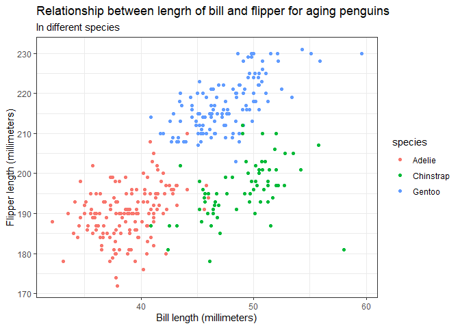
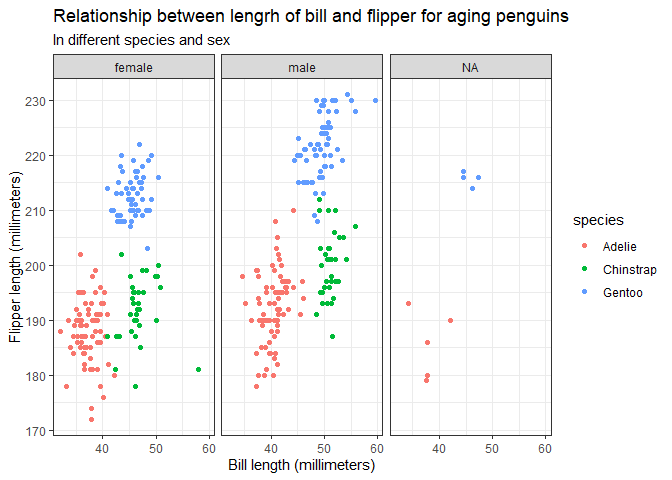

7462hw1
================
Xiao Ma
2022/2/2

``` r
library(forcats)
library(ggplot2)
library(dplyr)
library(readr)
set.seed(7462)
x<-rnorm(mean = 0,sd=1,n=1000)
y<-rnorm(mean = 1,sd=2,n=1000)
sum_indicator<-as.factor(ifelse(x+y>0.5,TRUE,FALSE))
sum_indicator<-fct_relevel(sum_indicator,"TRUE","FALSE")
tibble<-data.frame(x,y,sum_indicator)

tibble %>%
  mutate("X + Y > 0.5"=sum_indicator) %>%
  ggplot(aes(x=x,y=y,color=`X + Y > 0.5`))+
  geom_point()+
  xlab("Random Sample N(0, 1)")+
  ylab("Random Sample N(1, 2)")+
  theme_bw()+
  labs(title = "Sum of two independent bivariate normal random sample",
       subtitle = "Whether the sum is larger than 0.5")
```

<!-- -->

``` r
penguin.df <- read_rds("./data/penguin.RDS")
round(colMeans(penguin.df[,c(3,5)],na.rm = T),digits = 2)
round(sd(penguin.df$bill_length_mm,na.rm = T),digits = 2)
round(sd(penguin.df$flipper_length_mm,na.rm = T),digits = 2)
```

# Problem 2.2.1

-   Each observation (row) details: there are 344 rows and 8 variables:
    -   species a factor denoting penguin species (Adélie, Chinstrap and
        Gentoo) island a factor denoting
    -   island in Palmer Archipelago, Antarctica (Biscoe, Dream or
        Torgersen)
    -   bill\_length\_mm: a number denoting bill length (millimeters)
    -   bill\_depth\_mm: a number denoting bill depth (millimeters)
    -   flipper\_length\_mm: an integer denoting flipper length
        (millimeters)
    -   body\_mass\_g: an integer denoting body mass (grams)
    -   sex: a factor denoting penguin sex (female, male)
    -   year: an integer denoting the study year (2007, 2008, or 2009)
-   The mean of flipper length is 200.92 and the sd is 14.06, the mean
    of bill length is 43.92 and the sd is 5.46.

``` r
penguin.df %>%
  ggplot(aes(x=bill_length_mm,y=flipper_length_mm,color=species))+
  geom_point()+
  xlab("Bill length (millimeters)")+
  ylab("Flipper length (millimeters)")+
  theme_bw()+
  labs(title = "Relationship between lengrh of bill and flipper for aging penguins",
       subtitle = "In different species")
```

    ## Warning: Removed 2 rows containing missing values (geom_point).

<!-- -->

``` r
penguin.df %>%
  ggplot(aes(x=bill_length_mm,y=flipper_length_mm,color=species))+
  geom_point()+
  facet_wrap(~sex)+
  xlab("Bill length (millimeters)")+
  ylab("Flipper length (millimeters)")+
  theme_bw()+
  labs(title = "Relationship between lengrh of bill and flipper for aging penguins",
       subtitle = "In different species and sex")
```

<!-- -->

-   There is no specific line relationship between length of bill and
    flipper in each species and sex.
-   Gentoo penguins tend to have longer bill and flipper length compared
    with Adelle.
-   For penguins have same flipper length, Chinstrap tends to have
    longer bill length than Addelle.
-   For penguins have same bill length, Gentoo tends to have longer
    flipper length than Chinstrap.
